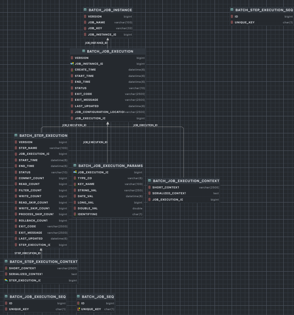

## 스프링 배치 시작 - DB 스키마 생성

1. 스프링 배치 메타 데이터
   - 스프링 배치의 실행 및 관리를 위한 목적으로 여러 도메인들(Job, Step, JobParameters..) 의 정보들을 저장, 업데이트, 조회할 수 있는 스키마 제공
   - 과거, 현재의 실행에 대한 세세한 정보, 실행에 대한 성공과 실패 여부 등을 일목요연하게 관리함으로서 배치운용에 있어 리스크 발생시 빠른 대처 가능
   - DB 와 연동할 경우 필수적으로 메타 테이블이 생성 되어야 함
2. DB 스키마 제공
   - 파일 위치 : /org/springframework/batch/core/schema-*.sql
   - DB 유형별로 제공

3. 스키마 생성 설정
   - 수동 생성 – 쿼리 복사 후 직접 실행
   - 자동 생성 - spring.batch.jdbc.initialize-schema 설정
     - ALWAYS
       - 스크립트 항상 실행
       - RDBMS 설정이 되어 있을 경우 내장 DB 보다 우선적으로 실행 EMBEDDED : 내장 DB일 때만 실행되며 스키마가 자동 생성됨, 기본값
     - NEVER
       - 스크립트 항상 실행 안함
       - 내장 DB 일경우 스크립트가 생성이 안되기 때문에 오류 발생
       - 운영에서 수동으로 스크립트 생성 후 설정하는 것을 권장

  
