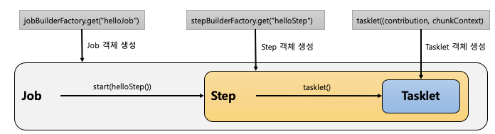
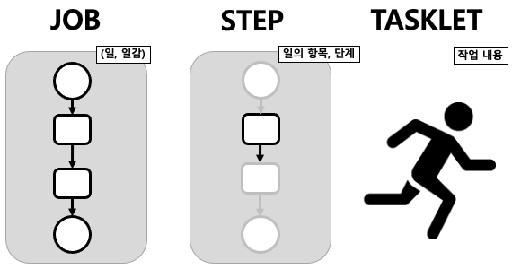

## 스프링 배치 시작

```java

@Configuration
@RequiredArgsConstructor
public class HelloJobConfiguration {

    private final JobBuilderFactory jobBuilderFactory;
    private final StepBuilderFactory stepBuilderFactory;

    @Bean
    public Job helloJob() {
        return jobBuilderFactory.get("helloJob")
                .start(helloStep1())
                .next(helloStep2())
                .build();
    }

    @Bean
    public Step helloStep1() {
        return stepBuilderFactory.get("helloStep")
                .tasklet((contribution, chunkContext) -> {
                    System.out.println("================================");
                    System.out.println(" >> step1 was executed");
                    System.out.println("================================");
                    return RepeatStatus.FINISHED;
                })
                .build();
    }

    @Bean
    public Step helloStep2() {
        return stepBuilderFactory.get("helloStep2")
                .tasklet((contribution, chunkContext) -> {
                    System.out.println("================================");
                    System.out.println(" >> step2 was executed");
                    System.out.println("================================");
                    return RepeatStatus.FINISHED;
                })
                .build();
    }
}
```

1. @Configuration 선언
    1. 하나의 배치 Job 을 정의하고 빈 설정
2. JobBuilderFactory
    1. job 을 생성하는 빌더 팩토리
3. StepBuilderFactory
    1. Step 을 생성하는 빌더 팩토리
4. Job
    1. helloJob 이름으로 Job 생성
5. Step
    1. helloStep 이름으로 Step 생성
6. tasklet
    1. Step 안에서 단일 테스크로 수행되는 로직 구현
7. Job 구동 -> Step 을 실행 -> Tasklet 을 실행

  

Job 이 구동되면 Step 을 실행하고 Step 이 구동되면 Taskelt 을 실행하도록 설정함  

  
