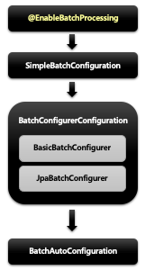

## 스프링 배치 시작

### @EnableBatchProcessing

스프링 배치가 작동하기 위해 선언해야 하는 어노테이션

```java

@EnableBatchProcessing
@SpringBootApplication
public class SpringBatchApplication {

    public static void main(String[] args) {
        SpringApplication.run(SpringBatchApplication.class, args);
    }

}
```

- 총 4개의 설정 클래스를 실행시키며 스프링 배치의 모든 초기화 및 실행 구성이 이루어진다
- 스프링 부트 배치의 자동 설정 클래스가 실행됨으로 빈으로 등록된 모든 Job 을 검색해서 초기화와 동시에 Job 을 수행하도록 구성됨

### 스프링 배치 초기화 설정 클래스

- 
- BatchAutoConfiguration
    - 스프링 배치가 초기화 될 때 자동으로 실행되는 설정 클래스
    - Job 을 수행하는 JobLauncherApplicationRunner 빈을 생성

- SimpleBatchConfiguration
    - JobBuilderFactory 와 StepBuilderFactory 생성
    - 스프링 배치의 주요 구성 요소 생성 - 프록시 객체로 생성됨

- BatchConfigurerConfiguration
    - BasicBatchConfigurer
        - SimpleBatchConfiguration 에서 생성한 프록시 객체의 실제 대상 객체를 생성하는 설정 클래스
        - 빈으로 의존성 주입 받아서 주요 객체들을 참조해서 사용할 수 있다
    - JpaBatchConfigurer
        - JPA 관련 객체를 생성하는 설정 클래스
        - 사용자 정의 BatchConfigurer 인터페이스를 구현하여 사용할 수 있음


