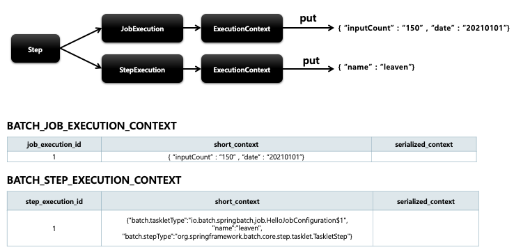
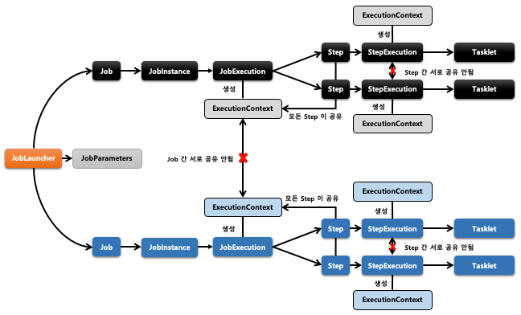

## 스프링 배치 도메인 이해 - ExecutionContext

1. 기본 개념
    - 프레임워크에서 유지 및 관리하는 키/값으로 된 컬렉션으로 StepExecution 또는 JobExecution 객체의 상태(state)를 저장하는 공유 객체
    - DB 에 직렬화 한 값으로 저장됨 - { “key” : “value”}
    - 공유 범위
        - Step 범위 – 각 Step 의 StepExecution 에 저장되며 Step 간 서로 공유 안됨
        - Job 범위 – 각 Job의 JobExecution 에 저장되며 Job 간 서로 공유 안되며 해당 Job의 Step 간 서로 공유됨
    - Job 재 시작시 이미 처리한 Row 데이터는 건너뛰고 이후로 수행하도록 할 때 상태 정보를 활용한다

2. 구조
    -   

  
  

