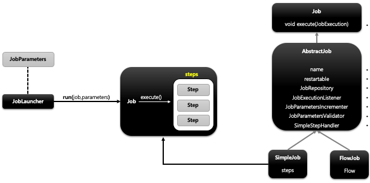

## 스프링 배치 도메인 이해 - Job

1. 기본 개념
    - 배치 계층 구조에서 가장 상위에 있는 개념으로서 하나의 배치작업 자체를 의미함
        - “API 서버의 접속 로그 데이터를 통계 서버로 옮기는 배치“ 인 Job 자체를 의미한다.
    - Job Configuration 을 통해 생성되는 객체 단위로서 배치작업을 어떻게 구성하고 실행할 것인지 전체적으로 설정하고 명세해 놓은 객체
    - 배치 Job 을 구성하기 위한 최상위 인터페이스이며 스프링 배치가 기본 구현체를 제공한다
    - 여러 Step 을 포함하고 있는 컨테이너로서 반드시 한개 이상의 Step으로 구성해야 함

2. 기본 구현체
    - SimpleJob
        - 순차적으로 Step 을 실행시키는 Job
        - 모든 Job에서 유용하게 사용할 수 있는 표준 기능을 갖고 있음
    - FlowJob
        - 특정한 조건과 흐름에 따라 Step 을 구성하여 실행시키는 Job
        - Flow 객체를 실행시켜서 작업을 진행함

