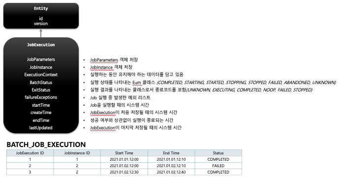
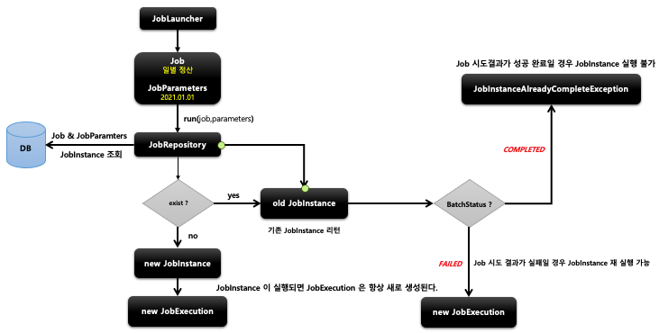

## 스프링 배치 도메인 이해 - JobExecution

1. 기본 개념

- JobInstance 에 대한 한번의 시도를 의미하는 객체로서 Job 실행 중에 발생한 정보들을 저장하고 있는 객체
    - 시작시간, 종료시간 ,상태(시작됨,완료,실패),종료상태의 속성을 가짐
- JobInstance 과의 관계
    - JobExecution 'FAILED' 또는 'COMPLETED‘ 등의 Job 의 실행 결과 상태를 가지고 있음
    - JobExecution 의 실행 상태 결과가 'COMPLETED’ 면 JobInstance 실행이 완료된 것으로 간주해서 재 실행이 불가함
    - JobExecution 의 실행 상태 결과가 'FAILED’ 면 JobInstance 실행이 완료되지 않은 것으로 간주해서 재실행이 가능함
        - JobParameter 가 동일한 값으로 Job 을 실행할지라도 JobInstance 를 계속 실행할 수 있음
    - JobExecution 의 실행 상태 결과가 'COMPLETED’ 될 때까지 하나의 JobInstance 내에서 여러 번의 시도가 생길 수 있음

2. BATCH_JOB_EXECUTION 테이블과 매핑
    - JobInstance 와 JobExecution 는 1:M 의 관계로서 JobInstance 에 대한 성공/실패의 내역을 가지고 있음

  
  

