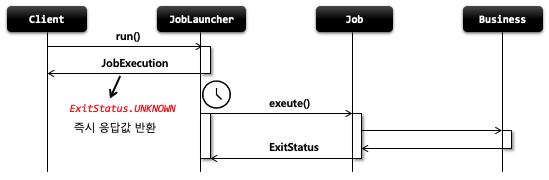

## 스프링 배치 도메인 이해 - JobLauncher

1. 기본 개념

- 배치 Job 을 실행시키는 역할을 한다
- Job 과 Job Parameters 를 인자로 받으며 요청된 배치 작업을 수행한 후 최종 client 에게 JobExecution 을 반환함
- 스프링 부트 배치가 구동이 되면 JobLauncher 빈이 자동 생성 된다
- Job 실행
    - JobLauncher.run(Job, JobParameters)
    - 스프링 부트 배치에서는 JobLauncherApplicationRunner 가 자동적으로 JobLauncher 을 실행시킨다
    - 동기적 실행
        - taskExecutor 를 SyncTaskExecutor 로 설정할 경우 (기본값은 SyncTaskExecutor)
        - JobExecution 을 획득하고 배치 처리를 최종 완료한 이후 Client 에게 JobExecution 을 반환
        - 스케줄러에 의한 배치처리에 적합 함 – 배치처리시간이 길어도 상관없는 경우
    - 비 동기적 실행
        - taskExecutor 가 SimpleAsyncTaskExecutor 로 설정할 경우
        - JobExecution 을 획득한 후 Client 에게 바로 JobExecution 을 반환하고 배치처리를 완료한다
        - HTTP 요청에 의한 배치처리에 적합함 – 배치처리 시간이 길 경우 응답이 늦어지지 않도록 함

2. 구조
    - 

- 동기적 실행
    - 
- 비동기적 실행
    - 