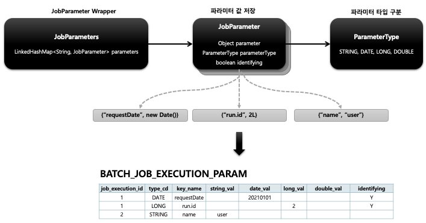

## 스프링 배치 도메인 이해 - JobParameter

1. 기본 개념
    - Job 을 실행할 때 함께 포함되어 사용되는 파라미터를 가진 도메인 객체
    - 하나의 Job 에 존재할 수 있는 여러개의 JobInstance 를 구분하기 위한 용도
    - JobParameters 와 JobInstance 는 1:1 관계

2. 생성 및 바인딩
    - 어플리케이션 실행 시 주입
        - Java -jar LogBatch.jar requestDate=20210101
    - 코드로 생성
        - `JobParameterBuilder`, `DefaultJobParametersConverter`
    - SpEL 이용
        - `@Value(“#{jobParameter[requestDate]}”)`, `@JobScope,` `@StepScope` 선언 필수

3. BATCH_JOB_EXECUTION_PARAM 테이블과 매핑
    - JOB_EXECUTION 과 1:M 의 관계



```shell
 java -jar springbatchlecture-0.0.1-SNAPSHOT.jar 'name=user1 seq(long)=2L date(date)=2022/05/16 age(double)=16.5'      
```