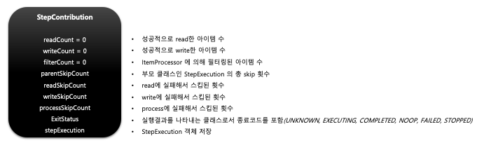
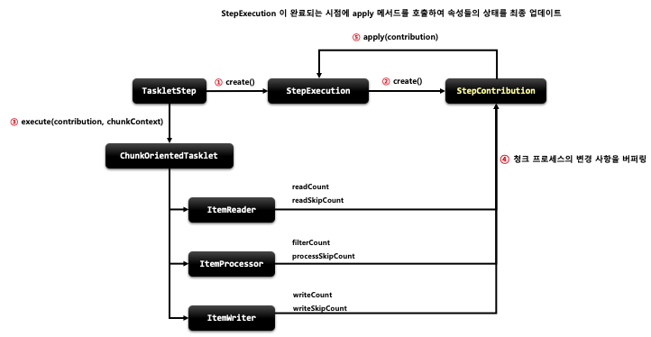

## 스프링 배치 도메인 이해 - StepContribution

1. 기본 개념
    - 청크 프로세스의 변경 사항을 버퍼링 한 후 StepExecution 상태를 업데이트하는 도메인 객체
    - 청크 커밋 직전에 StepExecution 의 apply 메서드를 호출하여 상태를 업데이트 함
    - ExitStatus 의 기본 종료코드 외 사용자 정의 종료코드를 생성해서 적용 할 수 있음

2. 구조
    - 

