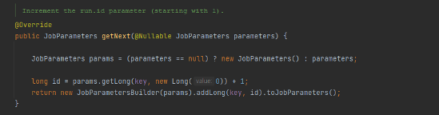

## 스프링 배치 실행 - incrementer()

1. 기본개념
    - JobParameters 에서 필요한 값을 증가시켜 다음에 사용될 JobParameters 오브젝트를 리턴
    - 기존의 JobParameter 변경없이 Job 을 여러 번 시작하고자 할때
    - RunIdIncrementer 구현체를 지원하며 인터페이스를 직접 구현할 수 있음
    - 


1. 구조
   - 
```java
public Job batchJob() {
    return jobBuilderFactory.get(“batchJob")
    .start()
    .next()
    .incrementer(JobParametersIncrementer)
    .validator()
    .preventRestart()
    .listener()
    .build();
}
```