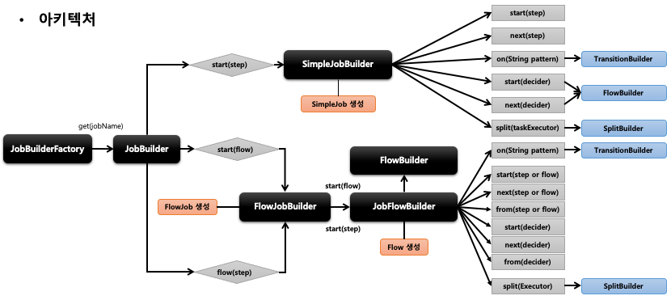
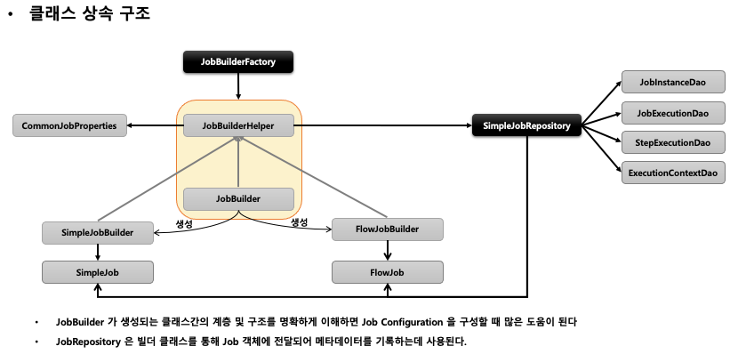

## 스프링 배치 실행 - JobBuilderFactory/JobBuilder

1. 스프링 배치는 Job 과 Step 을 쉽게 생성 및 설정할 수 있도록 util 성격의 빌더 클래스들을 제공함
2. JobBuilderFactory
    - JobBuilder 를 생성하는 팩토리 클래스로서 get(String name) 메서드 제공
    - jobBuilderFactory.get(“jobName")
        - “jobName” 은 스프링 배치가 Job 을 실행시킬 때 참조하는 Job 의 이름

3. JobBuilder
    - Job 을 구성하는 설정 조건에 따라 두 개의 하위 빌더 클래스를 생성하고 실제 Job 생성을 위임한다
    - SimpleJobBuilder
        - SimpleJob 을 생성하는 Builder 클래스
        - Job 실행과 관련된 여러 설정 API 를 제공한다
    - FlowJobBuilder
        - FlowJob 을 생성하는 Builder 클래스
        - 내부적으로 FlowBuilder 를 반환함으로써 Flow 실행과 관련된 여러 설정 API 를 제공한다

  

