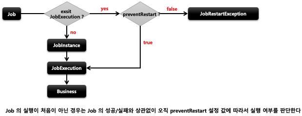

## 스프링 배치 실행 - preventRestart()

1. 기본개념
    - Job 의 재 시작 여부를 설정
    - 기본 값은 true 이며 false 로 설정 시 “ 이 Job 은 재 시작을 지원하지 않는다 ” 라는 의미
    - Job 이 실패해도 재 시작이 안되며 Job 을 재 시작하려고 하면 `JobRestartException`이 발생
    - 재 시작과 관련 있는 기능으로 Job 을 처음 실행하는 것 과는 아무런 상관 없음

2. 흐름도
    - 

```java
// 재시작을 하지 않음 (restartable = false)
public Job batchJob(){
    return jobBuilderFactory.get(“batchJob")
    .start()
    .next()
    .incrementer()
    .validator()
    .preventRestart()
    .listener()
    .build();
}
```