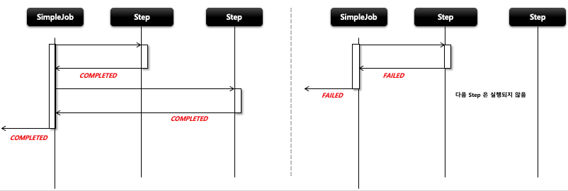
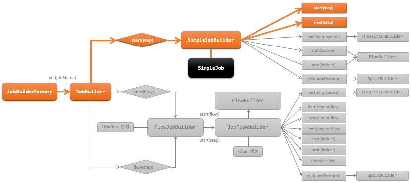

## 스프링 배치 실행 - 개념 및 API 소개

1. 기본개념
   - SimpleJob 은 Step 을 실행시키는 Job 구현체로서 SimpleJobBuilder 에 의해 생성된다
   - 여러 단계의 Step 으로 구성할 수 있으며 Step 을 순차적으로 실행시킨다
   - 모든 Step 의 실행이 성공적으로 완료되어야 Job 이 성공적으로 완료 된다
   - 맨 마지막에 실행한 Step 의 BatchStatus 가 Job 의 최종 BatchStatus 가 된다

2. 흐름
    - 

### JobBuilderFactory > JobBuilder > SimpleJobBuilder  > SimpleJob

```java
public Job batchJob() {
    return jobBuilderFactory.get(“batchJob") 
            .start(Step) 
            .next(Step)
            .incrementer(JobParametersIncrementer)
            .preventRestart(true)
            .validator(JobParameterValidator)
            .listener(JobExecutionListener)
            .build();
        // JobBuilder 를 생성하는 팩토리,  Job 의 이름을 매개변수로 받음
        // 처음 실행 할 Step 설정,  최초 한번 설정, 이 메서드를 실행하면 SimpleJobBuilder 반환
        // 다음에 실행 할 Step 설정, 횟수는 제한이 없으며 모든 next() 의 Step 이 종료가 되면 Job 이 종료된다
        // JobParameter 의 값을 자동을 증가해 주는 JobParametersIncrementer 설정
        // Job 의 재 시작 가능 여부 설정, 기본값은 true
        // JobParameter 를 실행하기 전에 올바른 구성이 되었는지 검증하는 JobParametersValidator 설정
        // Job 라이프 사이클의 특정 시점에 콜백 제공받도록 JobExecutionListener 설정 
        // SimpleJob 생성
        }
```



