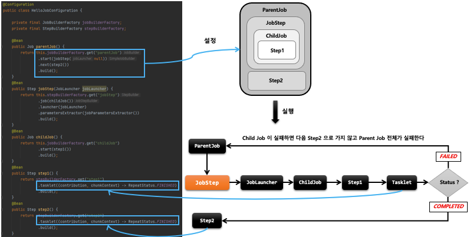
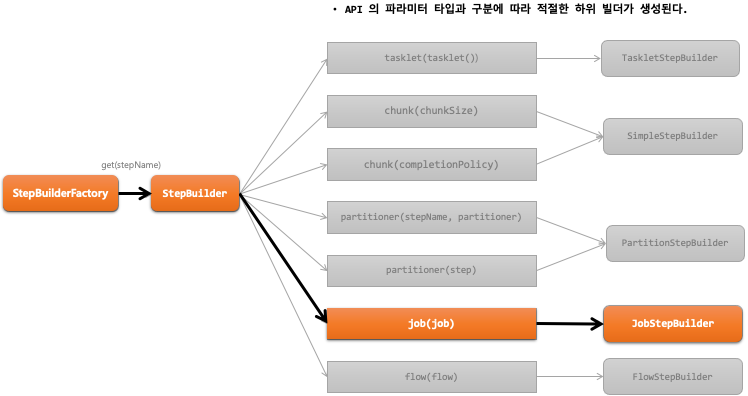
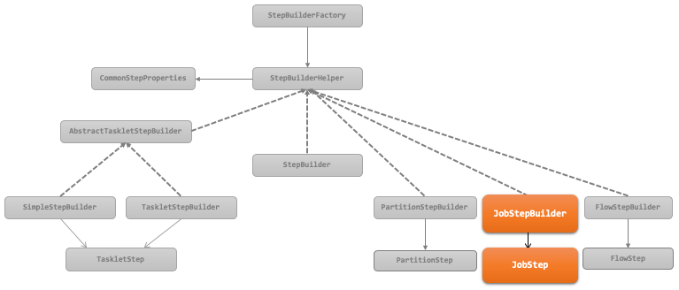

## 스프링 배치 실행 - JobStep

1. 기본 개념
    - Job 에 속하는 Step 중 외부의 Job 을 포함하고 있는 Step
    - 외부의 Job 이 실패하면 해당 Step 이 실패하므로 결국 최종 기본 Job 도 실패한다
    - 모든 메타데이터는 기본 Job 과 외부 Job 별로 각각 저장된다.
    - 커다란 시스템을 작은 모듈로 쪼개고 job의 흐름를 관리하고자 할 때 사용할 수 있다

API 소개

- StepBuilderFactory > StepBuilder > JobStepBuilder  > JobStep
    ```java
    public Step jobStep() {
        return stepBuilderFactory.get(“jobStep ")
               .job(Job)
                .launcher(JobLauncher)
                .parametersExtractor(JobParametersExtractor)
                .build();
    }  
    // StepBuilder 를 생성하는 팩토리,  Step 의 이름을 매개변수로 받음
    // JobStep 내 에서 실행 될 Job 설정, JobStepBuilder  반환
    // Job 을 실행할 JobLauncher설정
    // Step의 ExecutionContext를 Job이 실행되는 데 필요한 JobParameters로 변환
    // JobStep 을 생성
    ```






