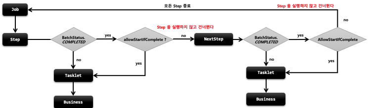

## 스프링 배치 실행 - startLimit()

1. 기본 개념
   - Step 의 실행 횟수를 조정할 수 있다
   - Step 마다 설정할 수 있다
   - 설정 값을 초과해서 다시 실행하려고 하면 `StartLimitExceededException`이 발생
   - start-limit 의 디폴트 값은 `Integer.MAX_VALUE`

2. API
```java
public Step batchStep() {
    return stepBuilderFactory.get(“batchStep")
        .tasklet(Tasklet)
        .startLimit(10)
        .allowStartIfComplete(true)
        .listener(StepExecutionListener)
        .build();
}
```
## 스프링 배치 실행 - allowStartComplete()

1. 기본 개념
   - 재시작 가능한 job 에서 Step 의 이전 성공 여부와 상관없이 항상 step 을 실행하기 위한 설정
   - 실행 마다 유효성을 검증하는 Step이나 사전 작업이 꼭 필요한 Step 등
   - 기본적으로 COMPLETED 상태를 가진 Step 은 Job 재 시작 시 실행하지 않고 스킵한다
   - allow-start-if-complete가 “true”로 설정된 step은 항상 실행한다

2. 흐름도
    - 

