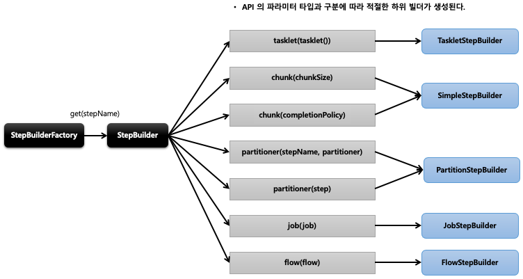
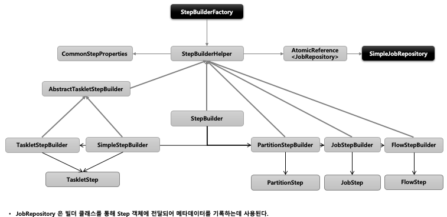

## 스프링 배치 실행 - StepBuilderFactory / StepBuilder

1. StepBuilderFactory
    - StepBuilder 를 생성하는 팩토리 클래스로서 get(String name) 메서드 제공
    - StepBuilderFactory.get(“stepName")
        - “stepName” 으로 Step 을 생성

2. StepBuilder
    - Step 을 구성하는 설정 조건에 따라 다섯 개의 하위 빌더 클래스를 생성하고 실제 Step 생성을 위임한다
    - TaskletStepBuilder
        - TaskletStep 을 생성하는 기본 빌더 클래스
    - SimpleStepBuilder
        - TaskletStep 을 생성하며 내부적으로 청크기반의 작업을 처리하는 ChunkOrientedTasklet 클래스를 생성한다
    - PartitionStepBuilder
        - PartitionStep 을 생성하며 멀티 스레드 방식으로 Job 을 실행한다
    - JobStepBuilder
        - JobStep 을 생성하여 Step 안에서 Job 을 실행한다
    - FlowStepBuilder
        - FlowStep 을 생성하여 Step 안에서 Flow 를 실행한다

