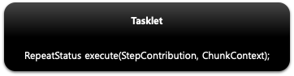

## 스프링 배치 실행 - tasklet()

1. 기본 개념
    - Tasklet 타입의 클래스를 설정한다
        - Tasklet
            - Step 내에서 구성되고 실행되는 도메인 객체로서 주로 단일 태스크를 수행하기위한 것
            - TaskletStep 에 의해 반복적으로 수행되며 반환값에 따라 계속 수행 혹은 종료한다
            - RepeatStatus - Tasklet 의 반복 여부 상태 값
                - RepeatStatus.FINISHED - Tasklet 종료, RepeatStatus 을 null 로 반환하면 RepeatStatus.FINISHED 로 해석됨
                - RepeatStatus.CONTINUABLE - Tasklet 반복
                - RepeatStatus.FINISHED 가 리턴되거나 실패 예외가 던져지기 전까지 TaskletStep 에 의해 while 문 안에서 반복적으로 호출됨 (무한루프 주의)
    - 익명 클래스 혹은 구현 클래스를 만들어서 사용한다
    - 이 메소드를 실행하게 되면 TaskletStepBuilder 가 반환되어 관련 API 를 설정할 수 있다.
    - Step 에 오직 하나의 Tasklet 설정이 가능하며 두개 이상을 설정 했을 경우 마지막에 설정한 객체가 실행된다

2. 구조
    - 
    