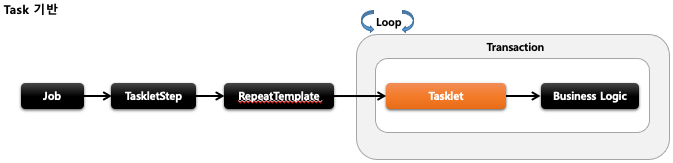
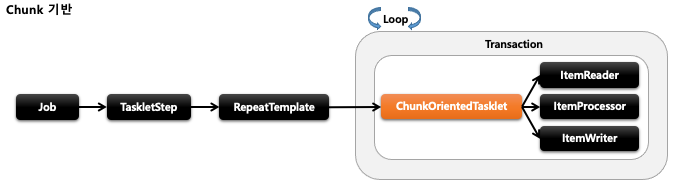
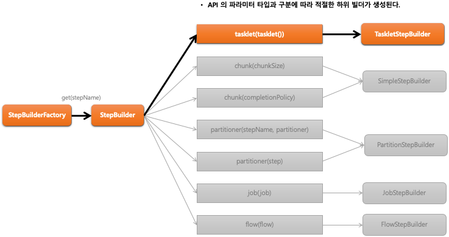

## 스프링 배치 실행 - 개념 및 API 소개

1. 기본 개념
    - 스프링 배치에서 제공하는 Step 의 구현체로서 Tasklet 을 실행시키는 도메인 객체
    - RepeatTemplate 를 사용해서 Tasklet 의 구문을 트랜잭션 경계 내에서 반복해서 실행함
    - Task 기반과 Chunk 기반으로 나누어서 Tasklet 을 실행함

2. Task vs Chunk 기반 비교

- 스프링 배치에서 Step 의 실행 단위는 크게 2가지로 나누어짐
    - chunk 기반
        - 하나의 큰 덩어리를 n개씩 나눠서 실행한다는 의미로 대량 처리를 하는 경우 효과적으로 설계 됨
        - ItemReader, ItemProcessor, ItemWriter 를 사용하며 청크 기반 전용 Tasklet 인 ChunkOrientedTasklet 구현체가 제공된다
    - Task 기반
        - ItemReader 와 ItemWriter 와 같은 청크 기반의 작업 보다 단일 작업 기반으로 처리되는 것이 더 효율적인 경우
        - 주로 Tasklet 구현체를 만들어 사용
        - 대량 처리를 하는 경우 chunk 기반에 비해 더 복잡한 구현 필요

- 
- 

### StepBuilderFactory > StepBuilder > TaskletStepBuilder  > TaskletStep
```java
public Step batchStep() {
    return stepBuilderFactory.get(“batchStep")
       .tasklet(Tasklet)
        .startLimit(10)
        .allowStartIfComplete(true)
        .listener(StepExecutionListener)
        .build();
}
// StepBuilder 를 생성하는 팩토리,  Step 의 이름을 매개변수로 받음
// Tasklet 클래스 설정, 이 메서드를 실행하면 TaskletStepBuilder 반환
// Step 의 실행 횟수를 설정, 설정한 만큼 실행되고 초과시 오류 발생, 기본값음 INTEGER.MAX_VALUE
// Step 의 성공, 실패와 상관없이 항상 Step 을 실행하기 위한 설정
// Step 라이프 사이클의 특정 시점에 콜백 제공받도록 StepExecutionListener 설정
// TaskletStep 을 생성

// Task 기반으로 TaskletStep 생성
public Step step() {
    return this.stepBuilderFactory.get("step")
        .tasklet(myTasklet())
        .build();
} 

// Chunk 기반으로 TaskletStep 생성
public Step step(){
    return this.stepBuilderFactory.get("step")
    .<String, String>chunk(100)
    .reader()
    .writer()
    .build()
}
```


