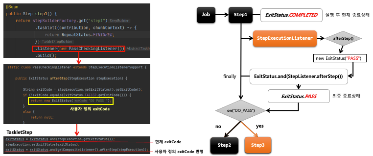

## 스프링 배치 실행 - 사용자 정의 ExitStatus

1. 기본 개념
    - `ExitStatus` 에 존재하지 않는 exitCode 를 새롭게 정의해서 설정
    - `StepExecutionListener`의 afterStep() 메서드에서 Custom exitCode 생성 후 새로운 `ExitStatus` 반환
    - Step 실행 후 완료 시점에서 현재 exitCode 를 사용자 정의 exitCode 로 수정할 수 있음

