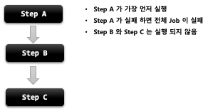
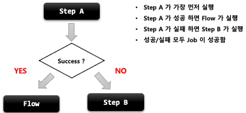
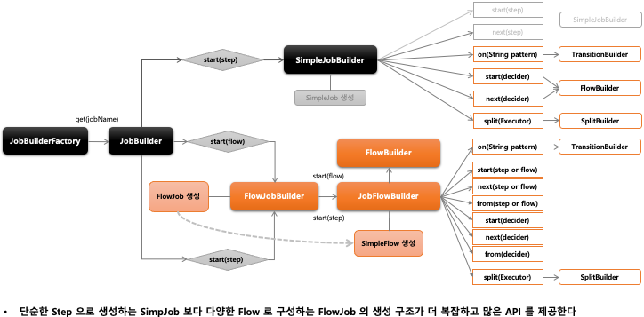
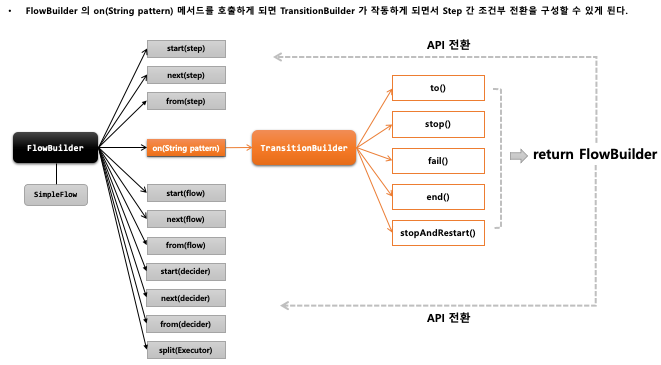

## 스프링 배치 실행 - 개념 및 API 소개

1. 기본개념
    - Step 을 순차적으로만 구성하는 것이 아닌 특정한 상태에 따라 흐름을 전환하도록 구성할 수 있으며 FlowJobBuilder 에 의해 생성된다
        - Step 이 실패 하더라도 Job 은 실패로 끝나지 않도록 해야 하는 경우
        - Step 이 성공 했을 때 다음에 실행해야 할 Step 을 구분해서 실행 해야 하는경우
        - 특정 Step 은 전혀 실행되지 않게 구성 해야 하는 경우
    - Flow 와 Job 의 흐름을 구성하는데만 관여하고 실제 비즈니스 로직은 Step 에서 이루어진다
    - 내부적으로 SimpleFlow 객체를 포함하고 있으며 Job 실행 시 호출한다


1. SimpleJob vs FlowJob
    - SimpleJob - 순차적 흐름
    - 
    - FlowJob - 조건적 흐름
    - 

```java
public Job batchJob(){
    return jobBuilderFactory.get(“batchJob")
        .start(Step)
        .on(String pattern)
        .to(Step)
        .stop().fail().end().stopAndRestart()
        .from(Step)
        .next(Step)
        .end()
        .build();
        // Flow 시작하는 Step 설정
        // Step의 실행 결과로 돌려받는 종료상태 (ExitStatus)를 캐치하여 매칭하는 패턴, TransitionBuilder 반환
        // 다음으로 이동할 Step 지정
        // Flow 를 중지 / 실패 / 종료 하도록  Flow 종료
        // 이전 단계에서 정의한 Step 의 Flow 를 추가적으로 정의함
        // 다음으로 이동할 Step 지정
        // build() 앞에 위치하면 FlowBuilder 를 종료하고 SimpleFlow 객체 생성
        // FlowJob 생성하고 flow 필드에 SimpleFlow 저장
        }
```


