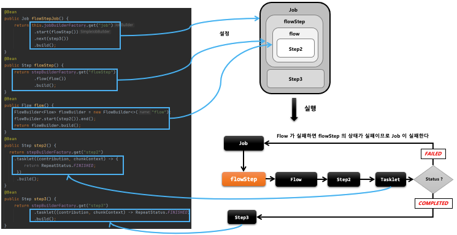
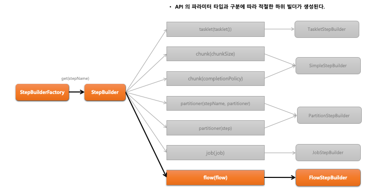
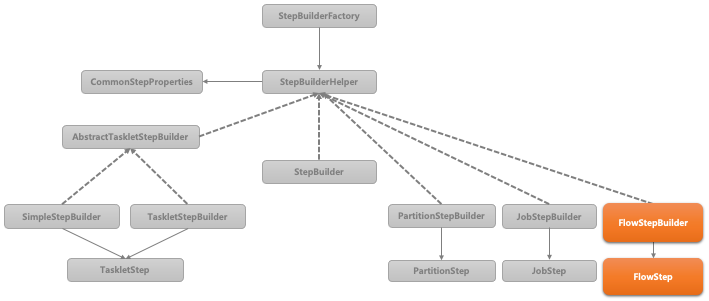

## 스프링 배치 실행 - FlowStep

1. 기본 개념
    - Step 내에 Flow 를 할당하여 실행시키는 도메인 객체
    - flowStep 의 BatchStatus 와 ExitStatus 은 Flow 의 최종 상태값에 따라 결정된다.

2. API 소개
    - #### StepBuilderFactory > StepBuilder > FlowStepBuilder  > FlowStep
    ```java
    public Step flowStep() {
        return stepBuilderFactory.get(“flowStep")
            .flow(flow())
            .build();
    }
    // Step 내에서 실행 될 flow 설정, FlowStepBuilder 반환
    // FlowStep 객체를 생성
    ```





