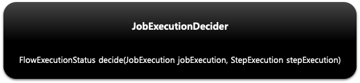
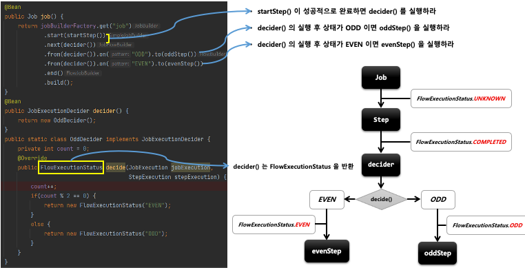

## 스프링 배치 실행 - JobExecutionDecider

1. 기본 개념
    - `ExitStatus`를 조작하거나 `StepExecutionListener`를 등록할 필요 없이 `Transition` 처리를 위한 전용 클래스
    - `Step` 과 `Transition` 역할을 명확히 분리해서 설정 할 수 있음
    - `Step` 의 `ExitStatus` 가 아닌 `JobExecutionDecider` 의  `FlowExecutionStatus` 상태값을 새롭게 설정해서 반환함

2. 구조

- 

