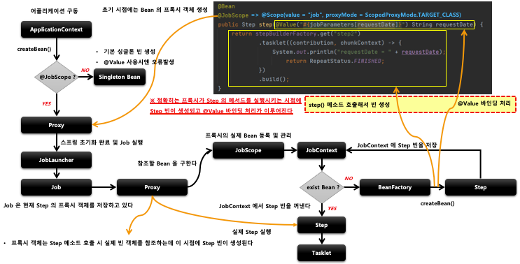

## 스프링 배치 실행 - 아키텍쳐

1. Proxy 객체 생성
    - `@JobScope`, `@StepScope` 어노테이션이 붙은 빈 선언은 내부적으로 빈의 Proxy 객체가 생성된다
        - `@JobScope`
            - `@Scope(value = "job", proxyMode = ScopedProxyMode.TARGET_CLASS)`
        - `@StepScope`
            - `@Scope(value = “step", proxyMode = ScopedProxyMode.TARGET_CLASS)`

    - Job 실행 시 Proxy 객체가 실제 빈을 호출해서 해당 메서드를 실행시키는 구조

2. JobScope , StepScope
    - Proxy 객체의 실제 대상이 되는 Bean 을 등록, 해제하는 역할
    - 실제 빈을 저장하고 있는 JobContext, StepContext 를 가지고 있다

3. JobContext , StepContext
    - 스프링 컨테이너에서 생성된 빈을 저장하는 컨텍스트 역할
    - Job 의 실행 시점에서 프록시 객체가 실제 빈을 참조할 때 사용됨

