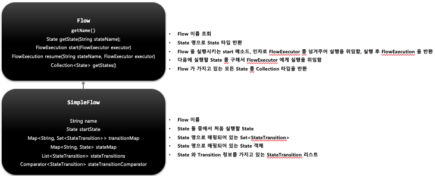

## 스프링 배치 실행 - 개념 및 API 소개

1. 기본 개념
   - 스프링 배치에서 제공하는 Flow 의 구현체로서 각 요소(Step, Flow, JobExecutionDecider) 들을 담고 있는 State 를 실행시키는 도메인 객체
   - FlowBuilder 를 사용해서 생성하며 Transition 과 조합하여 여러 개의 Flow 및 중첩 Flow 를 만들어 Job 을 구성할 수 있다

2. 구조
   - 
   