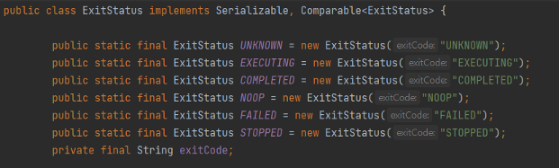
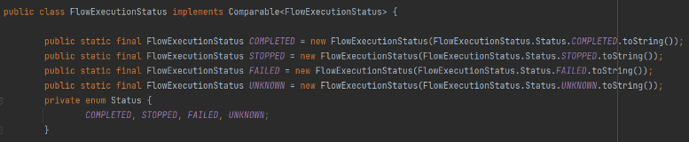
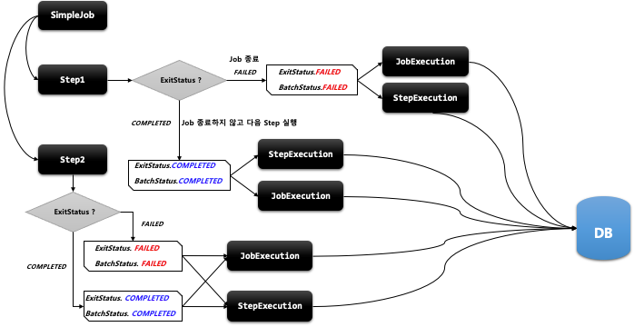

## 스프링 배치 실행 - 배치 상태 유형

- BatchStatus
    - JobExecution 과 StepExecution의 속성으로 Job 과 Step 의 종료 후 최종 결과 상태가 무엇인지 정의
    - SimpleJob
        - 마지막 Step 의 BatchStatus 값을 Job 의 최종 BatchStatus 값으로 반영
        - Step 이 실패할 경우 해당 Step 이 마지막 Step 이 된다
    - FlowJob
        - Flow 내 Step 의 ExitStatus 값을 FlowExecutionStatus 값으로 저장
        - 마지막 Flow 의 FlowExecutionStatus 값을 Job 의 최종 BatchStatus 값으로 반영

- COMPLETED, STARTING, STARTED, STOPPING, STOPPED, FAILED, ABANDONED, UNKNOWN
- ABANDONED 는 처리를 완료했지만 성공하지 못한 단계와 재시작시 건너 뛰어야하는 단계
    ```java
    public enum BatchStatus {STARTING, STARTED, STOPPING, 
                STOPPED, FAILED, COMPLETED, ABANDONED }
    ```

- ExitStatus
    - JobExecution 과 StepExecution의 속성으로 Job 과 Step 의 실행 후 어떤 상태로 종료되었는지 정의
    - 기본적으로 ExitStatus 는 BatchStatus 와 동일한 값으로 설정된다
    - SimpleJob
        - 마지막 Step 의 ExitStatus 값을 Job 의 최종 ExitStatus 값으로 반영
    - FlowJob
        - Flow 내 Step 의 ExitStatus 값을 FlowExecutionStatus 값으로 저장
        - 마지막 Flow 의 FlowExecutionStatus 값을 Job 의 최종 ExitStatus 값으로 반영
    - UNKNOWN, EXECUTING, COMPLETED, NOOP, FAILED, STOPPED
    - exitCode 속성으로 참조
    - 
- FlowExecutionStatus
    - FlowExecution 의 속성으로 Flow 의 실행 후 최종 결과 상태가 무엇인지 정의
    - Flow 내 Step 이 실행되고 나서 ExitStatus 값을 FlowExecutionStatus 값으로 저장
    - FlowJob 의 배치 결과 상태에 관여함
    - COMPLETED, STOPPED, FAILED, UNKNOWN
    - 


