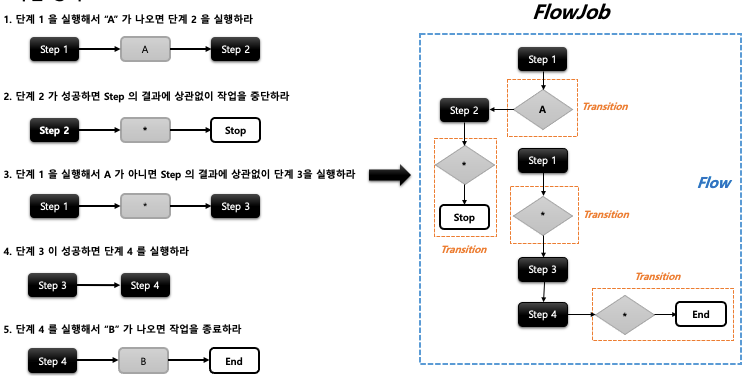
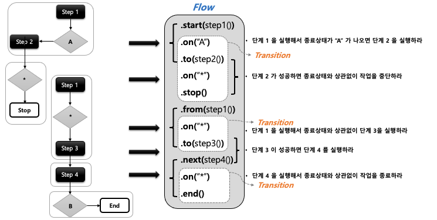
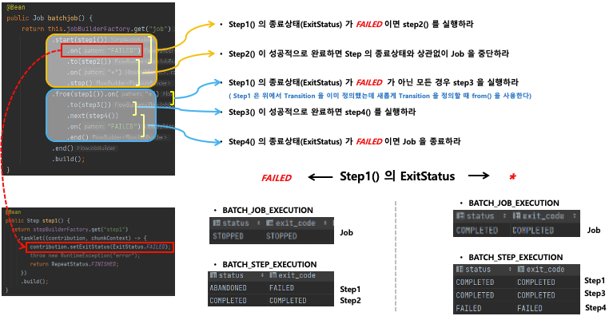

## 스프링 배치 실행 - Transition

- 기본 개념
    - Transition
        - `Flow` 내 `Step` 의 조건부 전환(전이)을 정의함
        - `Job` 의 API 설정에서 on(String pattern) 메소드를 호출하면 `TransitionBuilder` 가 반환되어 Transition Flow 를 구성할 수 있음
        - `Step` 의 종료상태(ExitStatus) 가 어떤 pattern 과도 매칭되지 않으면 스프링 배치에서 예외을 발생하고 Job 은 실패
        - transition 은 **구체적인 것부터 그렇지 않은 순서**로 적용된다
    - API
        - on(String pattern)
            - `Step` 의 실행 결과로 돌려받는 종료상태(ExitStatus)와 매칭하는 패턴 스키마, `BatchStatus` 와 매칭하는 것이 아님
            - pattern 과 `ExitStatus` 와 매칭이 되면 다음으로 실행할 `Step` 을 지정할 수 있다.
            - 특수문자는 두 가지만 허용
                - “*” : 0개 이상의 문자와 매칭, 모든 ExitStatus 와 매칭된다
                - ”?” : 정확히 1개의 문자와 매칭
                - ex) “c*t”는 “cat”과 “count”에 매칭되고, “c?t”는 “cat”에는 매칭되지만 “count”
        - to()
            - 다음으로 실행할 단계를 지정
        - from()
            - 이전 단계에서 정의한 Transition 을 새롭게 추가 정의함

- Job 을 중단하거나 종료하는 Transition API
    - `Flow` 가 실행되면 `FlowExecutionStatus` 에 상태값이 저장되고 최종적으로 Job 의 `BatchStatus` 와 `ExitStatus` 에 반영된다.
    - `Step` 의 `BatchStatus` 및 `ExitStatus` 에는 아무런 영향을 주지 않고 Job 의 상태만을 변경한다
    - stop()
        - `FlowExecutionStatus` 가 STOPPED 상태로 종료되는 transition
        - `Job` 의 `BatchStatus` 와 `ExitStatus` 가 STOPPED 으로 종료됨
    - fail()
        - `FlowExecutionStatus` 가 FAILED 상태로 종료되는 transition
        - `Job` 의 `BatchStatus` 와 `ExitStatus` 가 FAILED 으로 종료됨
    - end()
        - `FlowExecutionStatus` 가 COMPLETED 상태로 종료 되는 transition
        - `Job` 의 `BatchStatus` 와 `ExitStatus` 가 COMPLETED 으로 종료됨
        - `Step` 의 `ExitStatus` 가 FAILED 이더라도 `Job` 의 `BatchStatus` 가 COMPLETED 로 종료하도록 가능하며 이 때 `Job` 의 재시작은 불가능함
    - stopAndRestart(Step or Flow or JobExecutionDecider)
        - stop() transition 과 기본 흐름은 동일
        - 특정 step 에서 작업을 중단하도록 설정하면 중단 이전의 Step 만 COMPLETED 저장되고 이후의 step 은 실행되지 않고 STOPPED 상태로 Job 종료
        - `Job` 이 다시 실행됐을 때 실행해야 할 step 을 restart 인자로 넘기면 이전에 COMPLETED 로 저장된 step 은 건너뛰고 중단 이후 step 부터 시작한다

- 작업 정의
    - 
    - 
    - 
    