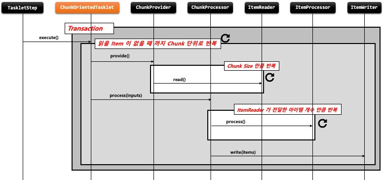
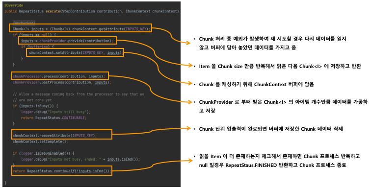

## ChunkOrientedTasklet - 개념 및 API 소개

- 기본 개념
    - ChunkOrientedTasklet 은 스프링 배치에서 제공하는 Tasklet 의 구현체로서 Chunk 지향 프로세싱를 담당하는 도메인 객체
    - ItemReader, ItemWriter, ItemProcessor 를 사용해 Chunk 기반의 데이터 입출력 처리를 담당한다
    - TaskletStep 에 의해서 반복적으로 실행되며 ChunkOrientedTasklet 이 실행 될 때마다 매번 새로운 트랜잭션이 생성되어 처리가 이루어진다
    - exception 이 발생할 경우, 해당 Chunk 는 롤백 되며 이전에 커밋한 Chunk 는 완료된 상태가 유지된다
    - 내부적으로 ItemReader 를 핸들링 하는 ChunkProvider 와 ItemProcessor, ItemWriter 를 핸들링하는 ChunkProcessor 타입의 구현체를 가진다




### StepBuilderFactory > StepBuilder > SimpleStepBuilder  > TaskletStep

```java
public Step chunkStep(){
    return stepBuilderFactory.get(“chunkStep")
            .<I, O>chunk(10)
            .<I, O>chunk(CompletionPolicy)
            .reader(itemReader())
            .writer(itemWriter())
            .processor(itemProcessor())
            .stream(ItemStream())
            .readerIsTransactionalQueue()
            .listener(ChunkListener)
            .build();
}
// chunk size 설정, chunk size 는 commit interval 을 의미함, input, output 제네릭타입 설정, 
// Chunk 프로세스를 완료하기 위한 정책 설정 클래스 지정
// 소스로 부터 item 을 읽거나 가져오는 ItemReader 구현체 설정
// item 을 목적지에 쓰거나 보내기 위한 ItemWriter 구현체 설정
// item 을 변형, 가공, 필터링 하기 위한 ItemProcessor 구현체 설정
// 재시작 데이터를 관리하는 콜백에 대한 스트림 등록
// Item 이 JMS, Message Queue Server 와 같은 트랜잭션 외부에서 읽혀지고 캐시할 것인지 여부, 기본값은 false
// Chunk 프로세스가 진행되는 특정 시점에 콜백 제공받도록 ChunkListener 설정
```


