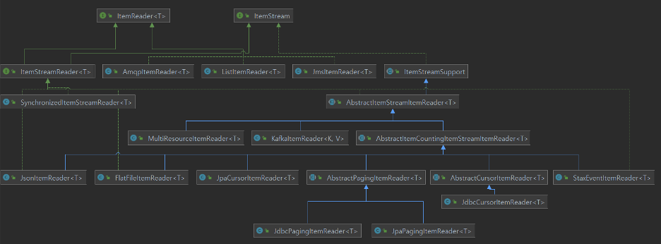
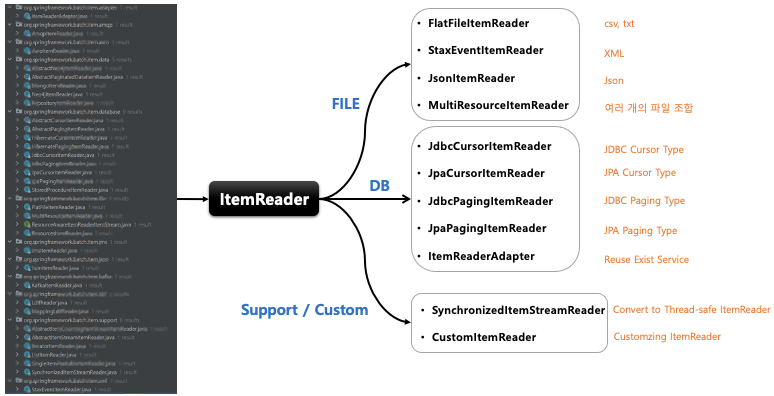
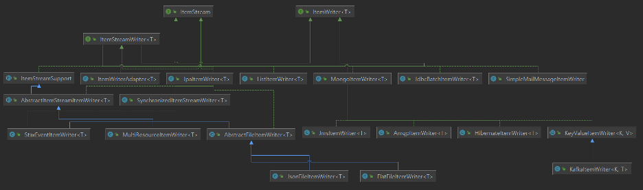
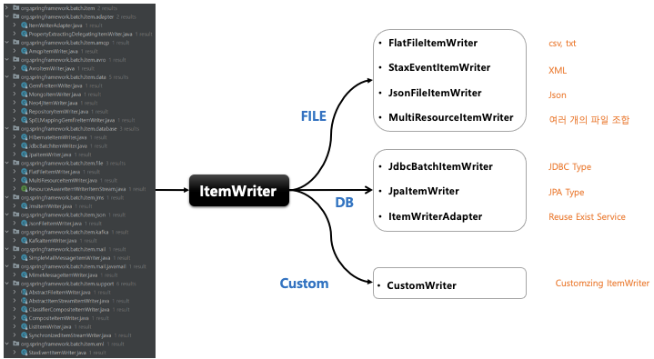

## 스프링 배치 청크 프로세스(1) - ItemReader

- 기본 개념
    - 다양한 입력으로부터 데이터를 읽어서 제공하는 인터페이스
        - 플랫(Flat) 파일 – csv, txt (고정 위치로 정의된 데이터 필드나 특수문자로 구별된 데이터의 행)
        - XML, Json
        - Database
        - JMS, RabbitMQ 와 같은 Message Queuing 서비스
        - Custom Reader - 구현 시 멀티 스레드 환경에서 스레드에 안전하게 구현할 필요가 있음
    - ChunkOrientedTasklet 실행 시 필수적 요소로 설정해야 한다

- 구조
    - 
    - T read()
        - 입력 데이터를 읽고 다음 데이터로 이동한다
        - 아이템 하나를 리턴하며 더 이상 아이템이 없는 경우 null 리턴
        - 아이템 하나는 파일의 한줄, DB 의 한 row 혹은 XML 파일에서 하나의 엘리먼트가 될 수 있다
        - 더 이상 처리해야 할 Item 이 없어도 예외가 발생하지 않고 ItemProcessor 와 같은 다음 단계로 넘어 간다

  

- 다수의 구현체들이 ItemReader 와 ItemStream 인터페이스를 동시에 구현하고 있음
    - 파일의 스트림을 열거나 종료, DB 커넥션을 열거나 종료, 입력 장치 초기화 등의 작업
    - ExecutionContext 에 read 와 관련된 여러가지 상태 정보를 저장해서 재시작 시 다시 참조 하도록 지원
- 일부를 제외하고 하위 클래스들은 기본적으로 스레드에 안전하지 않기 때문에 병렬 처리시 데이터 정합성을 위한 동기화 처리 필요

## 스프링 배치 청크 프로세스(1) - ItemWriter

- 기본 개념
    - Chunk 단위로 데이터를 받아 일괄 출력 작업을 위한 인터페이스
        - 플랫(Flat) 파일 – csv, txt
        - XML, Json
        - Database
        - JMS, RabbitMQ 와 같은 Messag Queuing 서비스
        - Mail Service
        - Custom Writer
    - 아이템 하나가 아닌 아이템 리스트를 전달 받는다.
    - ChunkOrientedTasklet 실행 시 필수적 요소로 설정해야 한다
- 구조
    - 
    - void write(List<? extends T> items)
        - 출력 데이터를 아이템 리스트로 받아 처리한다
        - 출력이 완료되고 트랜잭션이 종료되면 새로운 Chunk 단위 프로세스로 이동한다

- 다수의 구현체들이 ItemWriter 와 ItemStream 을 동시에 구현하고 있다
    - 파일의 스트림을 열거나 종료, DB 커넥션을 열거나 종료, 출력 장치 초기화 등의 작업
- 보통 ItemReader 구현체와 1:1 대응 관계인 구현체들로 구성되어 있다

## 스프링 배치 청크 프로세스(1) - ItemProcessor

- 기본 개념
    - 데이터를 출력하기 전에 데이터를 가공, 변형, 필터링하는 역할
    - `ItemReader` 및 `ItemWriter` 와 분리되어 비즈니스 로직을 구현할 수 있다
    - `ItemReader` 로 부터 받은 아이템을 특정 타입으로 변환해서 `ItemWriter`에 넘겨 줄 수 있다
    - `ItemReader` 로 부터 받은 아이템들 중 필터과정을 거쳐 원하는 아이템들만 `ItemWriter` 에게 넘겨줄 수 있다
        - `ItemProcessor` 에서 `process()` 실행결과 `null`을 반환하면 `Chunk<O>` 에 저장되지 않기 때문에 결국 `ItemWriter`에 전달되지 않는다
    - `ChunkOrientedTasklet` 실행 시 선택적 요소이기 때문에 청크 기반 프로세싱에서 `ItemProcessor` 단계가 반드시 필요한 것은 아니다.
- 구조
    - 
    - O process
        - <I> 제네릭은 `ItemReader`에서 받을 데이터 타입 지정
        - <O> 제네릭은 `ItemWriter` 에게 보낼 데이터 타입 지정
        - 아이템 하나씩 가공 처리하며 `null` 리턴할 경우 해당 아이템은 `Chunk<O>` 에 저장되지 않음
