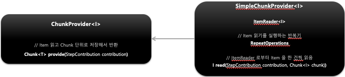
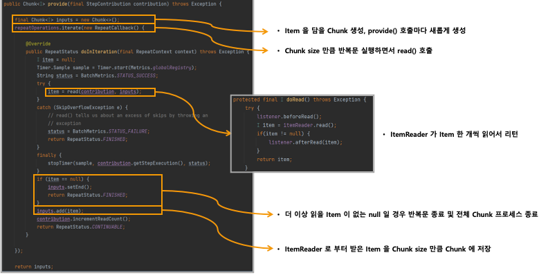
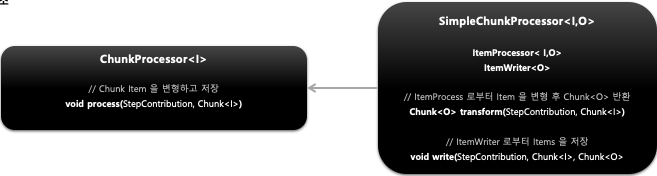

## 스프링 배치 청크 프로세스(1) - ChunkProvider

1. 기본 개념
    - `ItemReader` 를 사용해서 소스로부터 아이템을 Chunk size 만큼 읽어서 Chunk 단위로 만들어 제공하는 도메인 객체
    - `Chunk<I>` 를 만들고 내부적으로 반복문을 사용해서 `ItemReader.read()` 를 계속 호출하면서 item 을 Chunk 에 쌓는다
    - 외부로 부터 `ChunkProvider` 가 호출될 때마다 항상 새로운 Chunk 가 생성된다
    - 반복문 종료 시점
        - Chunk size 만큼 item 을 읽으면 반복문 종료되고 `ChunkProcessor` 로 넘어감
        - `ItemReader` 가 읽은 `item` 이 `null` 일 경우 반복문 종료 및 해당 `Step` 반복문까지 종료
    - 기본 구현체로서 `SimpleChunkProvider` 와 `FaultTolerantChunkProvider` 가 있다
2. 구조
    - 

## 스프링 배치 청크 프로세스(1) - ChunkProcessor

- 기본 개념
  - `ItemProcessor` 를 사용해서 `Item` 을 변형, 가공, 필터링하고 `ItemWriter` 를 사용해서 `Chunk` 데이터를 저장, 출력한다
  - `Chunk<O>` 를 만들고 앞에서 넘어온 `Chunk<I>` 의 `item` 을 한 건씩 처리한 후 `Chunk<O>` 에 저장한다
  - 외부로 부터 `ChunkProcessor` 가 호출될 때마다 항상 새로운 `Chunk` 가 생성된다
  - `ItemProcessor` 는 설정 시 선택사항으로서 만약 객체가 존재하지 않을 경우 `ItemReader` 에서 읽은 `item` 그대로가 `Chunk<O>` 에 저장된다
  - `ItemProcessor` 처리가 완료되면 `Chunk<O>` 에 있는 `List<Item>` 을 `ItemWriter` 에게 전달한다
  - `ItemWriter` 처리가 완료되면 `Chunk` 트랜잭션이 종료하게 되고 `Step` 반복문에서 `ChunkOrientedTasklet` 가 새롭게 실행된다
  - `ItemWriter` 는 Chunk size 만큼 데이터를 Commit 처리 하기 때문에 Chunk size 는 곧 Commit Interval 이 된다
  - 기본 구현체로서 `SimpleChunkProcessor` 와 `FaultTolerantChunkProcessor` 가 있다
- 구조
  - 

