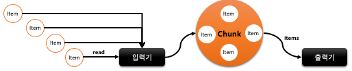
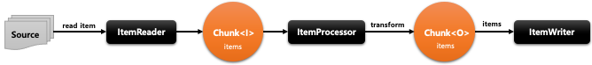
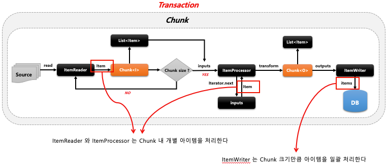

## 스프링 배치 청크 프로세스(1) - Chunk

- 기본개념
    - Chunk 란 여러 개의 아이템을 묶은 하나의 덩어리, 블록을 의미
    - 한번에 하나씩 아이템을 입력 받아 Chunk 단위의 덩어리로 만든 후 Chunk 단위로 트랜잭션을 처리함, 즉 Chunk 단위의 Commit 과 Rollback 이 이루어짐
    - 일반적으로 대용량 데이터를 한번에 처리하는 것이 아닌 청크 단위로 쪼개어서 더 이상 처리할 데이터가 없을 때까지 반복해서 입출력하는데 사용됨
    - 

- Chunk<I> vs Chunk<O>
    - Chunk<I> 는 ItemReader 로 읽은 하나의 아이템을 Chunk 에서 정한 개수만큼 반복해서 저장하는 타입
    - Chunk<O> 는 ItemReader 로부터 전달받은 Chunk<I> 를 참조해서 ItemProcessor 에서 적절하게 가공, 필터링한 다음 ItemWriter 에 전달하는 타입
    - 

