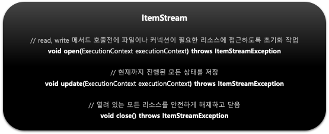
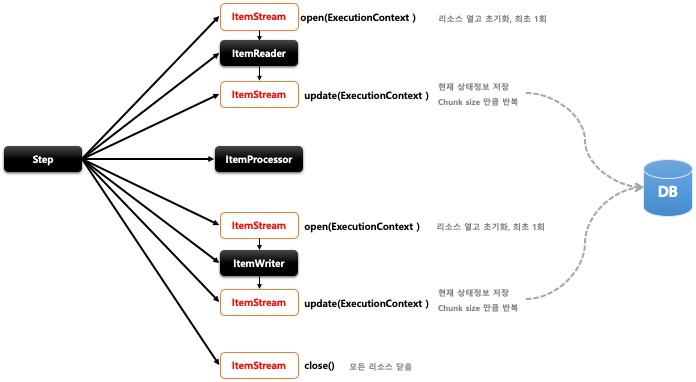

## 스프링 배치 청크 프로세스(1) - ItemStream

- 기본 개념
  - ItemReader 와 ItemWriter 처리 과정 중 상태를 저장하고 오류가 발생하면 해당 상태를 참조하여 실패한 곳에서 재 시작 하도록 지원
  - 리소스를 열고(open) 닫아야(close) 하며 입출력 장치 초기화 등의 작업을 해야 하는 경우
  - ExecutionContext 를 매개변수로 받아서 상태 정보를 업데이트(update) 한다
  - ItemReader 및 ItemWriter 는 ItemStream 을 구현해야 한다
- 구조
  - 

    