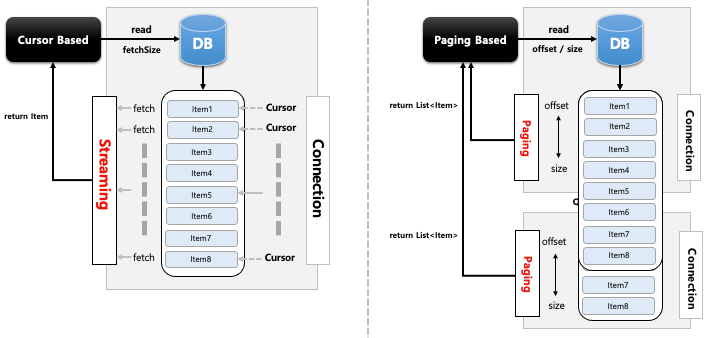

## 스프링 배치 청크 프로세스(2) - Cursor Based & Paging Based

- 기본 개념
  - 배치 어플리케이션은 실시간적 처리가 어려운 대용량 데이터를 다루며 이 때 DB I/O 의 성능문제와 메모리 자원의 효율성 문제를 해결할 수 있어야 한다.
  - 스프링 배치에서는 대용량 데이터 처리를 위한 두 가지 해결방안을 제시하고 있다
- Cursor Based 처리
  - JDBC ResultSet 의 기본 메커니즘을 사용
  - 현재 행에 커서를 유지하며 다음 데이터를 호출하면 다음 행으로 커서를 이동하며 데이터 반환이 이루어지는 Streaming 방식의 I/O 이다
  - ResultSet 이 open 될 때마다 next() 메소드가 호출 되어 Database 의 데이터가 반환되고 객체와 매핑이 이루어진다.
  - DB Connection 이 연결되면 배치 처리가 완료될 때 까지 데이터를 읽어오기 때문에 DB와 SocketTimeout 을 충분히 큰 값으로 설정 필요
  - 모든 결과를 메모리에 할당하기 때문에 메모리 사용량이 많아지는 단점이 있다
  - Connection 연결 유지 시간과 메모리 공간이 충분하다면 대량의 데이터 처리에 적합할 수 있다 (fetchSize 조절)
- Paging Based 처리
  - 페이징 단위로 데이터를 조회하는 방식으로 Page Size 만큼 한번에 메모리로 가지고 온 다음 한 개씩 읽는다.
  - 한 페이지를 읽을때마다 Connection 을 맺고 끊기 때문에 대량의 데이터를 처리하더라도 SocketTimeout 예외가 거의 일어나지 않는다
  - 시작 행 번호를 지정하고 페이지에 반환시키고자 하는 행의 수를 지정한 후 사용 – Offset, Limit
  - 페이징 단위의 결과만 메모리에 할당하기 때문에 메모리 사용량이 적어지는 장점이 있다
  - Connection 연결 유지 시간이 길지 않고 메모리 공간을 효율적으로 사용해야 하는 데이터 처리에 적합할 수 있다

