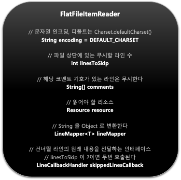
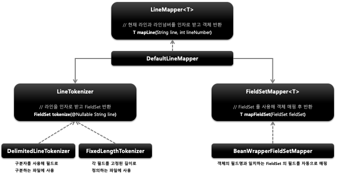
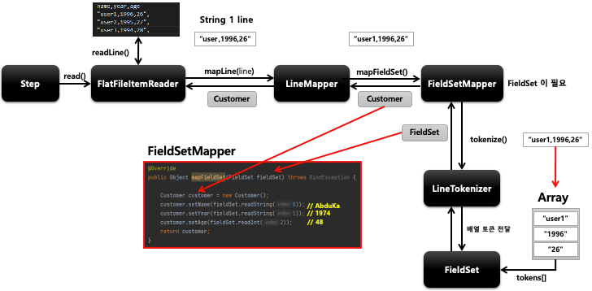

## 스프링 배치 청크 프로세스 (2) - 개념 및 API 소개

- 기본개념
  - 2차원 데이터(표)로 표현된 유형의 파일을 처리하는 ItemReader
  - 일반적으로 고정 위치로 정의된 데이터 필드나 특수 문자에 의해 구별된 데이터의 행을 읽는다
  - Resource 와 LineMapper 두 가지 요소가 필요하다
- 구조
  - 
- Resource
  - FileSystemResource – new FileSystemResource(“resource/path/config.xml”)
  - ClassPathResource – new ClassPathResource(“classpath:path/config.xml) 
- LineMapper
  - 파일의 라인 한줄을 Object 로 변환해서 FlatFileItemReader 로 리턴한다
  - 단순히 문자열을 받기 때문에 문자열을 토큰화해서 객체로 매핑하는 과정이 필요하다
  - LineTokenizer 와 FieldSetMapper 를 사용해서 처리한다
  - FieldSet
    - 라인을 필드로 구분해서 만든 배열 토큰을 전달하면 토큰 필드를 참조 할수 있도록 한다
    - JDBC 의 ResultSet 과 유사하다 ex) fs.readString(0), fs.readString(“name”)
  - LineTokenizer
    - 입력받은 라인을 FieldSet 으로 변환해서 리턴한다
    - 파일마다 형식이 다르기 때문에 문자열을 FieldSet 으로 변환하는 작업을 추상화시켜야 한다.
  - FieldSetMapper
    - FieldSet 객체를 받아서 원하는 객체로 매핑해서 리턴한다
    - JdbcTemplate 의 RowMapper 와 동일한 패턴을 사용한다

