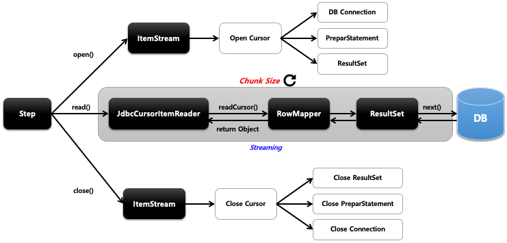

## 스프링 배치 청크 프로세스(2) - jdbcCursorItemReader

- 기본 개념
  - Cursor 기반의 JDBC 구현체로서 ResultSet 과 함께 사용되며 Datasource 에서 Connection 을 얻어와서 SQL 을 실행한다
  - Thread 안정성을 보장하지 않기 때문에 멀티 스레드 환경에서 사용할 경우 동시성 이슈가 발생하지 않도록 별도 동기화 처리가 필요하다
- API 
    ```java
    public JdbcCursorItemReader itemReader() {
        return new JdbcCursorItemReaderBuilder<T>()
            .name(“cursorItemReader")
            .fetchSize(int chunkSize)
            .dataSource(DataSource)
            .rowMapper(RowMapper)
            .beanRowMapper(Class<T>)
            .sql(String sql)
            .queryArguments(Object... args)
            .maxItemCount(int count)
            .currentItemCount(int count)
            .maxRows(int maxRows)
            .build();
    }
    // Cursor 방식으로 데이터를 가지고 올 때 한번에 메모리에 할당할 크기를 설정한다
    // DB 에 접근하기 위해 Datasource 설정
    // 쿼리 결과로 반환되는 데이터와 객체를 매핑하기 위한  RowMapper 설정
    // 별도의 RowMapper 을 설정하지 않고 클래스 타입을 설정하면 자동으로 객체와 매핑
    // ItemReader 가 조회 할 때 사용할 쿼리 문장 설정
    // 쿼리 파라미터 설정
    // 조회 할 최대 item 수
    // 조회 Item 의 시작 지점
    // ResultSet 오브젝트가 포함 할 수 있는 최대 행 수
    ```
  

