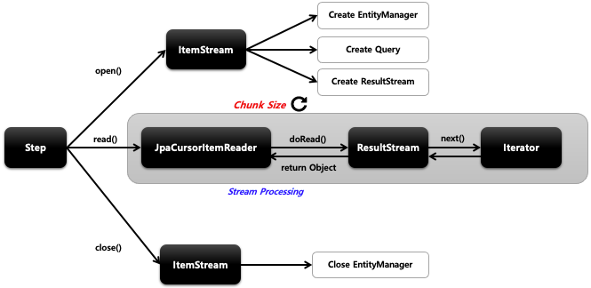

## 스프링 배치 청크 프로세스(2) - jpaCursorItemReader

- 기본 개념
  - Spring Batch 4.3 버전부터 지원함
  - Cursor 기반의 JPA 구현체로서 EntityManagerFactory 객체가 필요하며 쿼리는 JPQL 을 사용한다
- API 
```java
public JpaCursorItemReader itemReader() {
    return new JpaCursorItemReaderBuilder<T>()
        .name(“cursorItemReader")
        .queryString(String JPQL)
        .EntityManagerFactory(EntityManagerFactory)
        .parameterValue(Map<String, Object> parameters)
        .maxItemCount(int count)
        .currentItemCount(int count)
        .build();    
}
```

