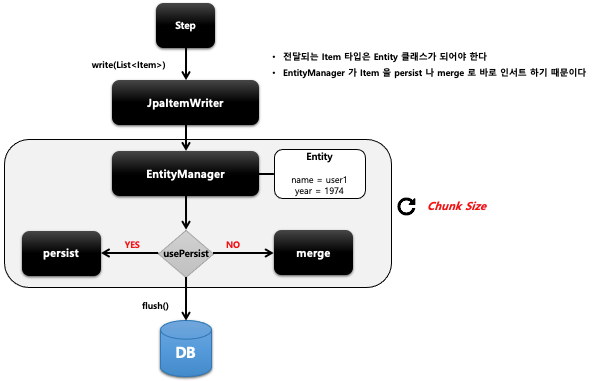

## 스프링 배치 청크 프로세스(2) - JpaItemWriter

- 기본 개념
  - JPA Entity 기반으로 데이터를 처리하며 EntityManagerFactory 를 주입받아 사용한다
  - Entity 를 하나씩 chunk 크기 만큼 insert  혹은 merge 한 다음 flush 한다
  - ItemReader 나 ItemProcessor 로 부터 아이템을 전발 받을 때는 Entity 클래스 타입으로 받아야 한다
- API
    ```java
    public JpaItemWriter itemWriter() {
        return new JpaItemWriterBuilder<T>()
            .usePersist(boolean)				
            .entityManagerFactory(EntityManagerFactory)
            .build();
    }
    ```

