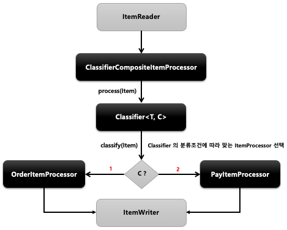

## 스프링 배치 청크 프로세스 (2) - ClassifierCompositeItemProcessor

- 기본 개념
  - Classifier 로 라우팅 패턴을 구현해서 ItemProcessor 구현체 중에서 하나를 호출하는 역할을 한다
- API
    ```java
    public ItemProcessor itemProcessor () {
    return new ClassifierCompositeItemProcessorBuilder<>()
    .classifier(Classifier)
    .build();
    }
    ```
    
  

