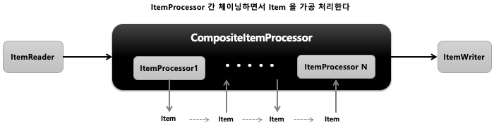

## 스프링 배치 청크 프로세스(2) - CompositeItemProcessor

- 기본 개념
  - ItemProcessor 들을 연결(Chaining)해서 위임하면 각 ItemProcessor 를 실행시킨다
  - 이전 ItemProcessor 반환 값은 다음 ItemProcessor 값 으로 연결된다
- API
    ```java
    public ItemProcessor itemProcessor () {
        return new CompositeItemProcessorBuilder<>()
            .delegates(ItemProcessor<?, ?>… delegates)
            .build();
    }
    ```

