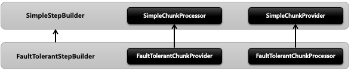
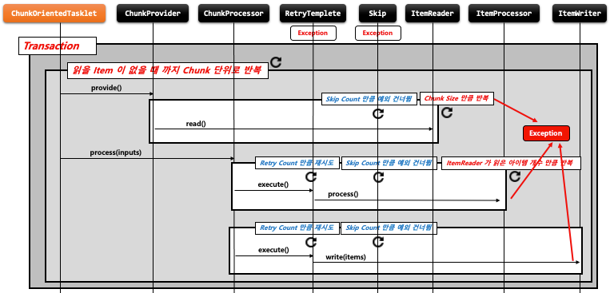

## 스프링 배치 반복 및 오류 제어 - FaultTolerant

- 기본 개념
    - 스프링 배치는 Job 실행 중에 오류가 발생할 경우 장애를 처리하기 위한 기능을 제공하며 이를 통해 복원력을 향상시킬 수 있다
    - 오류가 발생해도 Step 이 즉시 종료되지 않고 Retry 혹은 Skip 기능을 활성화 함으로써 내결함성 서비스가 가능하도록 한다
    - 프로그램의 내결함성을 위해 Skip 과 Retry 기능을 제공한다
        - Skip
            - ItemReader / ItemProcessor / ItemWriter 에 적용 할 수 있다
        - Retry
            - ItemProcessor / ItemWriter 에 적용할 수 있다
        - FaultTolerant 구조는 청크 기반의 프로세스 기반위에 Skip 과 Retry 기능이 추가되어 재정의 되어 있다

- 구조
    - 

