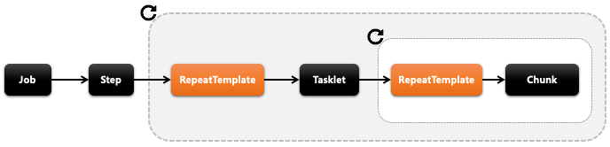
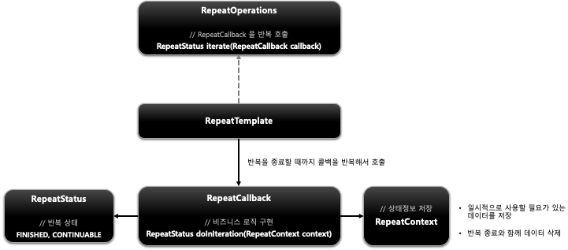
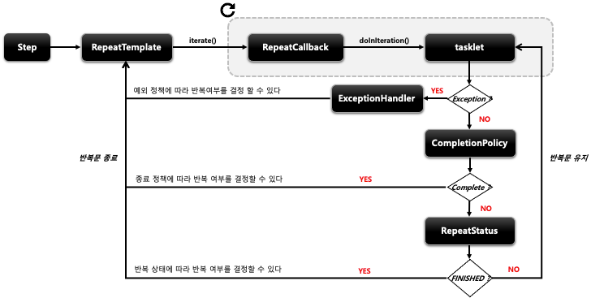
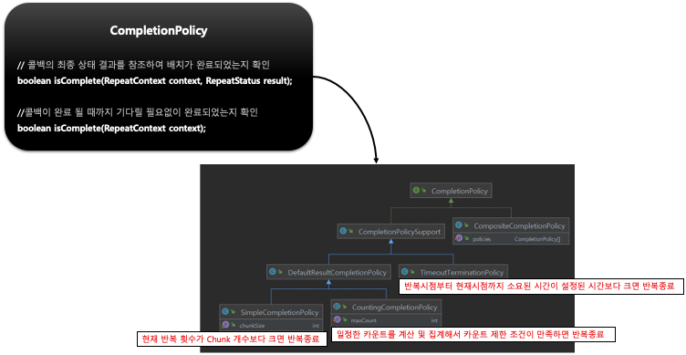
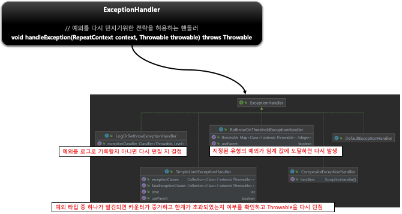

## 스프링 배치 반복 및 오류 제어 - Repeat

- 기본 개념
    - Spring Batch 는 얼마나 작업을 반복해야 하는지 알려 줄수 있는 기능을 제공한다.
    - 특정 조건이 충족 될 때까지 (또는 특정 조건이 아직 충족되지 않을 때까지) Job 또는 Step 을 반복하도록 배치 애플리케이션을 구성 할 수 있다.
    - 스프링 배치에서는 Step 의 반복과 Chunk 반복을 RepeatOperation 을 사용해서 처리하고 있다
    - 기본 구현체로 RepeatTemplate 를 제공한다
- 구조
    - 
- 반복을 종료할 것인지 여부를 결정하는 세가지 항목
    - RepeatStatus
        - 스프링 배치의 처리가 끝났는지 판별하기 위한 열거형(enum)
            - CONTINUABLE - 작업이 남아 있음
            - FINISHED - 더 이상의 반복 없음
- CompletionPolicy
    - RepeatTemplate 의 iterate 메소드 안에서 반복을 중단할지 결정
    - 실행 횟수 또는 완료시기, 오류 발생시 수행 할 작업에 대한 반복여부 결정
    - 정상 종료를 알리는데 사용된다
- ExceptionHandler
    - RepeatCallback 안에서 예외가 발생하면 RepeatTemplate 가 ExceptionHandler 를 참조해서 예외를 다시 던질지 여부 결정
    - 예외를 받아서 다시 던지게 되면 반복 종료
    - 비정상 종료를 알리는데 사용된다

