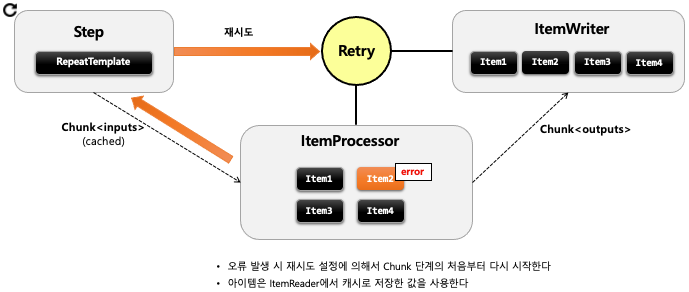
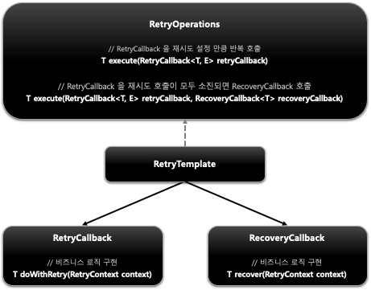
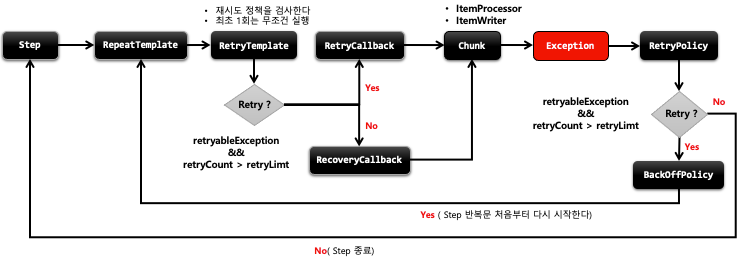
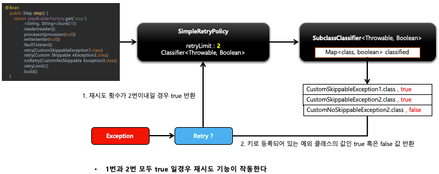
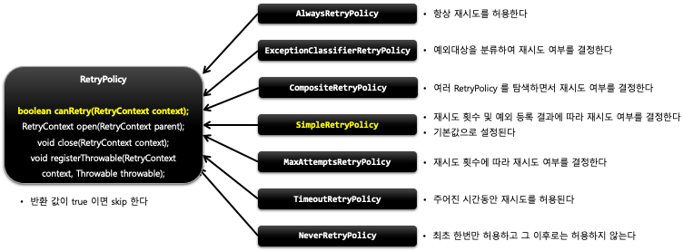

## 스프링 배치 반복 및 오류 제어 - Retry

- 기본개념
    - Retry 는 ItemProcess, ItemWriter 에서 설정된 Exception 이 발생했을 경우, 지정한 정책에 따라 데이터 처리를 재시도하는 기능이다.
    - Skip 과 마찬가지로 Retry 를 함으로써, 배치수행의 빈번한 실패를 줄일 수 있게 한다.
    - 

-   

- Retry 기능은 내부적으로 RetryPolicy 를 통해서 구현되어 있다
- Retry 가능 여부를 판별하는 기준은 다음과 같다
    1. 재시도 대상에 포함된 예외인지 여부
    2. 재시도 카운터를 초과 했는지 여부

-   
-   

- RetryPolicy
    - 재시도 정책에 따라 아이템의 retry 여부를 판단한하는 클래스
    - 기본적으로 제공하는 RetryPolicy 구현체들이 있으며 필요 시 직접 생성해서 사용할 수 있다.
    -   

