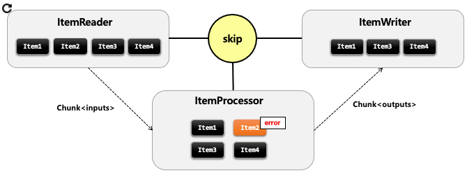
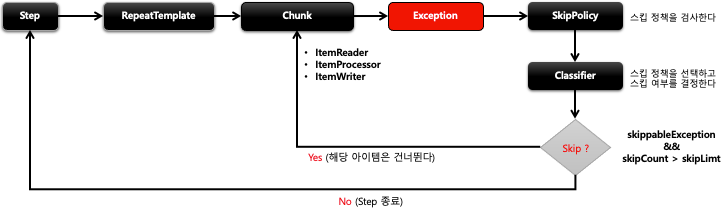
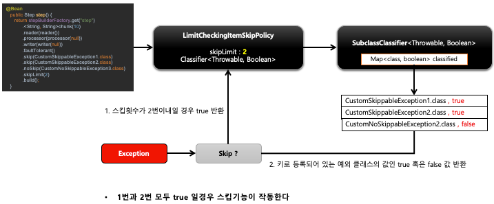
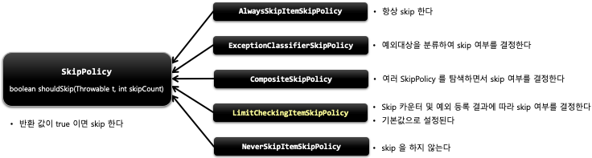

## 스프링 배치 반복 및 오류 제어 - Skip

- Skip 은 데이터를 처리하는 동안 설정된 Exception 이 발생했을 경우, 해당 데이터 처리를 건너뛰는 기능이다.
- 데이터의 사소한 오류에 대해 Step 의 실패처리 대신 Skip 을 함으로써, 배치수행의 빈번한 실패를 줄일 수 있게 한다.
- 
- 오류 발생 시 스킵 설정에 의해서 Item2 번은 건너뛰고 Item3번부터 다시 처리한다
- ItemReader 는 예외가 발생하면 해당 아이템만 스킵하고 계속 진행한다
- ItemProcessor 와 ItemWriter 는 예외가 발생하면 Chunk 의 처음으로 돌아가서 스킵된 아이템을 제외한 나머지 아이템들을 가지고 처리하게 된다

- Skip 기능은 내부적으로 SkipPolicy 를 통해서 구현되어 있다
- Skip 가능 여부를 판별하는 기준은 다음과 같다
    1. 스킵 대상에 포함된 예외인지 여부
    2. 스킵 카운터를 초과 했는지 여부

- 
- 

- 스킵 정책에 따라 아이템의 skip 여부를 판단한하는 클래스
- 스프링 배치가 기본적으로 제공하는 SkipPolicy 구현체들이 있으며 필요 시 직접 생성해서 사용할 수 있다. 그리고 내부적으로 Classifier 클래스들을 활용하고 있다.
- 
