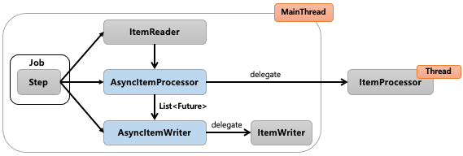
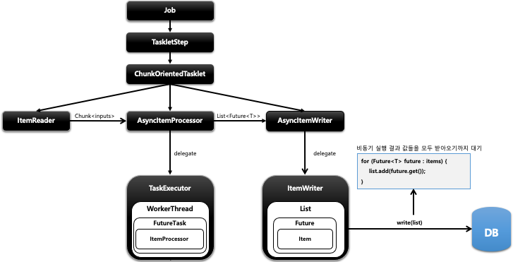

## 스프링 배치 멀티 스레드 프로세싱 - AsyncItemProcessor / AsyncItemWriter

- 기본개념
  - `Step` 안에서 `ItemProcessor` 가 비동기적으로 동작하는 구조
  - `AsyncItemProcessor` 와  `AsyncItemWriter` 가 함께 구성이 되어야 함
  - `AsyncItemProcessor` 로부터 `AsyncItemWriter` 가 받는 최종 결과값은 `List<Future<T>>` 타입이며 비동기 실행이 완료될 때까지 대기한다
  - spring-batch-integration 의존성이 필요하다






```java
public Step step() throws Exception {
	return stepBuilderFactory.get(“step") ①
            .chunk(100) ②
            .reader(pagingItemReader()) ③
            .processor(asyncItemProcessor()) ④
            .writer(asyncItemWriter()) ⑤
            .build() ⑥
}
```
1. ① Step 기본 설정
2. ② 청크 개수 설정
3. ③ ItemReader 설정 : 비동기 실행 아님
4. ④ 비동기 실행을 위한 AsyncItemProcessor 설정
   1. 스레드 풀 개수 만큼 스레드가 생성되어 비동기로 실행된다
   2. 내부적으로 실제 ItemProcessor 에게 실행을 위임하고 결과를 Future 에 저장한다
5. ⑤ AsyncItemWriter 설정
   1. 비동기 실행 결과 값들을 모두 받아오기까지 대기함
   2. 내부적으로 실제 ItemWriter 에게 최종 결과값을 넘겨주고 실행을 위임한다
6. ⑥ TaskletStep 생성
