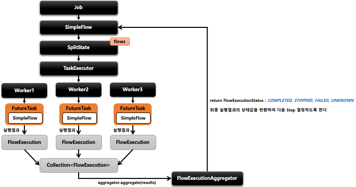

## 스프링 배치 멀티 스레드 프로세싱 - Parallel Steps 

- 기본개념
  - SplitState 를 사용해서 여러 개의 Flow 들을 병렬적으로 실행하는 구조
  - 실행이 다 완료된 후 FlowExecutionStatus 결과들을 취합해서 다음 단계 결정을 한다




```java
public Job job() {
    return jobBuilderFactory.get("job")
    .start(flow1()) ①
    .split(TaskExecutor).add(flow2(), flow3()) ②
    .next(flow4()) ③
    .end()
    .build();
}
// ① Flow 1을 생성한다
// ② Flow 2 와 Flow 3 을 생성하고 총 3개의 Flow를 합친다
// - taskExecutor 에서 flow 개수만큼 스레드를 생성해서 각 flow 를 실행시킨다
// ③ Flow 4 은 split 처리가 완료된 후 실행이 된다
```