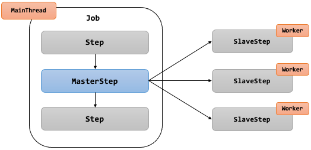
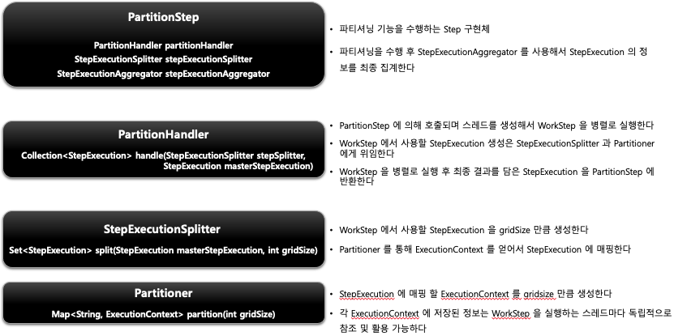
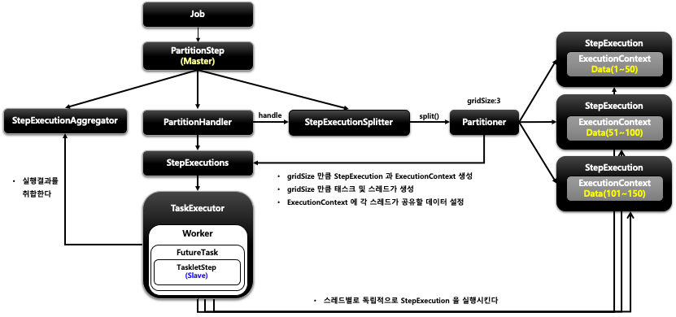
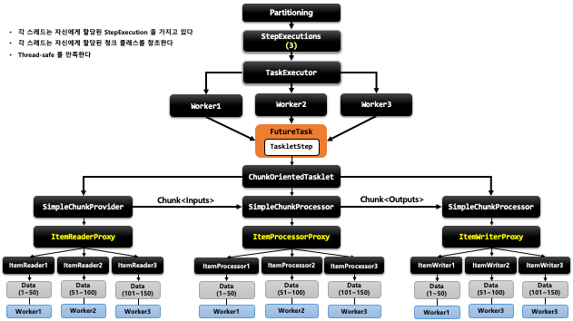

## 스프링 배치 멀티 스레드 프로세싱 - Partitioning

- 기본개념
  - MasterStep 이 SlaveStep 을 실행시키는 구조
  - SlaveStep 은 각 스레드에 의해 독립적으로 실행이 됨
  - SlaveStep 은 독립적인 StepExecution 파라미터 환경을 구성함
  - SlaveStep 은 ItemReader / ItemProcessor / ItemWriter 등을 가지고 동작하며 작업을 독립적으로 병렬 처리한다
  - MasterStep 은 PartitionStep 이며 SlaveStep 은 TaskletStep, FlowStep 등이 올 수 있다
    





```java
public Step step() throws Exception {
  return stepBuilderFactory.get("masterStep") ①
        .partitioner(“slaveStep”, new ColumnRangePartitioner()) ②
        .step(slaveStep()) ③
        .gridSize(4) ④
        .taskExecutor(ThreadPoolTaskExecutor()) ⑤
        .build() ⑥
// ① Step 기본 설정
// ② PartitionStep 생성을 위한 PartitionStepBuilder 가 생성되고 Partitioner 를 설정
// ③ 슬레이브 역할을 하는 Step 을 설정 : TaskletStep, FlowStep 등이 올수 있음
// ④ 파티션 구분을 위한 값 설정 : 몇 개의 파티션으로 나눌 것인지 사용됨
// ⑤ 스레드 풀 실행자 설정 : 스레드 생성, 스레드 풀 관리
// ⑥ PartitionStep 생성 : MasterStep 의 역할 담당
```