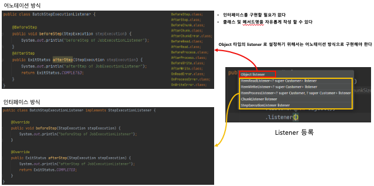
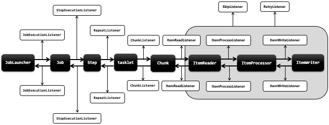

## 스프링 배치 이벤트 리스너 - 기본개념

- Listener 는 배치 흐름 중에 Job, Step, Chunk 단계의 실행 전후에 발생하는 이벤트를 받아 용도에 맞게 활용할 수 있도록 제공하는 인터셉터 개념의 클래스
- 각 단계별로 로그기록을 남기거나 소요된 시간을 계산하거나 실행상태 정보들을 참조 및 조회 할 수있다
- 이벤트를 받기 위해서는 Listener 를 등록해야 하며 등록은 API 설정에서 각 단계별로 지정 할 수 있다
- 
- Listeners
    - Job
        - JobExecutionListener – Job 실행 전후
    - Step
        - StepExecutionListener – Step 실행 전후
        - ChunkListener – Chunk 실행 전후 (Tasklet 실행 전후) , 오류 시점
        - ItemReadListener – ItemReader 실행 전후, 오류 시점, item 이 null 일 경우 호출 안됨
        - ItemProcessListener – ItemProcessor 실행 전후, 오류 시점, item 이 null 일 경우 호출 안됨
        - ItemWriteListener – ItemWriter 실행 전후, 오류 시점, item 이 null 일 경우 호출 안됨
    - SkipListener – 읽기, 쓰기, 처리 Skip 실행 시점, Item 처리가 Skip 될 경우 Skip 된 item 을 추적함
    - RetryListener – Retry 시작, 종료, 에러 시점
- 구현 방법
    - 
    - 

