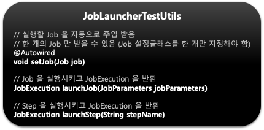
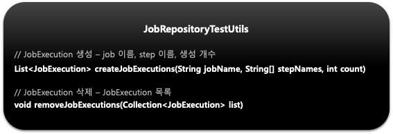

## 스프링 배치 테스트 및 운영 - Spring Batch test

- 스프링 배치 4.1.x 이상 버전 (부트 2.1) 기준
    ```xml
    <!--pom.xml-->
    <dependency>
        <groupId>org.springframework.batch</groupId>
        <artifactId>spring-batch-test</artifactId>
    </dependency>
    ```

- @SpringBatchTest
    - 자동으로 ApplicatonContext 에 테스트에 필요한 여러 유틸 Bean 을 등록해 주는 어노테이션
        - JobLauncherTestUtils
            - launchJob(), launchStep() 과 같은 스프링 배치 테스트에 필요한 유틸성 메소드 지원
        - JobRepositoryTestUtils
            - JobRepository 를 사용해서 JobExecution 을 생성 및 삭제 기능 메소드 지원
        - StepScopeTestExecutionListener
            - @StepScope 컨텍스트를 생성해 주며 해당 컨텍스트를 통해 JobParameter 등을 단위 테스트에서 DI 받을 수 있다
        - JobScopeTestExecutionListener
            - @JobScope 컨텍스트를 생성해 주며 해당 컨텍스트를 통해 JobParameter 등을 단위 테스트에서 DI 받을 수 있다.
        
-     
-     
